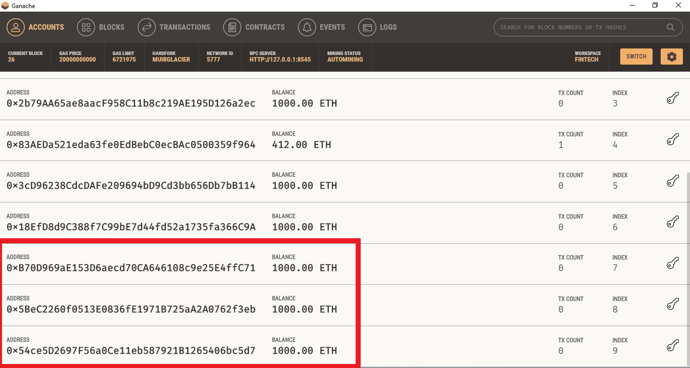

# Unit 20 - "Looks like we've made our First Contract!"

## Background

Your new startup has created its own Ethereum-compatible blockchain to help connect financial institutions, and the team wants to build smart contracts to automate some company finances to make everyone's lives easier, increase transparency, and to make accounting and auditing practically automatic!

Fortunately, you've been learning how to program smart contracts with Solidity! What you will be doing this assignment is creating 3 `ProfitSplitter` contracts. These contracts will do several things:

* Pay your Associate-level employees quickly and easily.

## Files

* [`AssociateProfitSplitter.sol`](Starter-Code/AssociateProfitSplitter.sol) -- Level 1 starter code.

## Instructions

This assignment has three levels of difficulty, with each contract increasing in complexity and capability. Although it is highly recommended you complete all three contracts, you are only required to solve one of the three contracts. Recommended to start with Level 1, then move forward as you complete the challenges. You can build all three with the skills you already have!

* **Level One** is an `AssociateProfitSplitter` contract. This will accept Ether into the contract and divide the Ether evenly among the associate level employees. This will allow the Human Resources department to pay employees quickly and efficiently.

### Starting your project

Navigate to the [Remix IDE](https://remix.ethereum.org) and create a new contract called `AssociateProfitSplitter.sol` using the starter code for level one above.

While developing and testing your contract, use the [Ganache](https://www.trufflesuite.com/ganache) development chain, and point MetaMask to `localhost:8545`, or replace the port with what you have set in your workspace.

### Level One: The `AssociateProfitSplitter` Contract

At the top of your contract, you will need to define the following `public` variables:

* `employee_one` -- The `address` of the first employee. Make sure to set this to `payable`.

* `employee_two` -- Another `address payable` that represents the second employee.

* `employee_three` -- The third `address payable` that represents the third employee.

Create a constructor function that accepts:

* `address payable _one`

* `address payable _two`

* `address payable _three`

Within the constructor, set the employee addresses to equal the parameter values. This will allow you to avoid hardcoding the employee addresses.

Next, create the following functions:

* `balance` -- This function should be set to `public view returns(uint)`, and must return the contract's current balance. Since we should always be sending Ether to the beneficiaries, this function should always return `0`. If it does not, the `deposit` function is not handling the remainders properly and should be fixed. This will serve as a test function of sorts.

* `deposit` -- This function should set to `public payable` check, ensuring that only the owner can call the function.

  * In this function, perform the following steps:

    * Set a `uint amount` to equal `msg.value / 3;` in order to calculate the split value of the Ether.

    * Transfer the `amount` to `employee_one`.

    * Repeat the steps for `employee_two` and `employee_three`.

    * Since `uint` only contains positive whole numbers, and Solidity does not fully support float/decimals, we must deal with a potential remainder at the end of this function since `amount` will discard the remainder during division.

    * We may either have `1` or `2` wei leftover, so transfer the `msg.value - amount * 3` back to `msg.sender`. This will re-multiply the `amount` by 3, then subtract it from the `msg.value` to account for any leftover wei, and send it back to Human Resources.

* Create a fallback function using `function() external payable`, and call the `deposit` function from within it. This will ensure that the logic in `deposit` executes if Ether is sent directly to the contract. This is important to prevent Ether from being locked in the contract since we don't have a `withdraw` function in this use-case.

#### Test the contract

In the `Deploy` tab in Remix, deploy the contract to your local Ganache chain by connecting to `Injected Web3` and ensuring MetaMask is pointed to `localhost:8545`.

You will need to fill in the constructor parameters with your designated `employee` addresses.

Test the `deposit` function by sending various values. Keep an eye on the `employee` balances as you send different amounts of Ether to the contract and ensure the logic is executing properly.

 

 

 

### Resources

Building the next financial revolution isn't easy, but we need your help, don't be intimidated by the semicolons!

There are lots of great resources to learn Solidity. Remember, you are helping push the very edge of this space forward,
so don't feel discouraged if you get stuck! In fact, you should be proud that you are taking on such a challenge!

For some succinct and straightforward code snips, check out [Solidity By Example](https://github.com/raineorshine/solidity-by-example)

For a more extensive list of awesome Solidity resources, checkout [Awesome Solidity](https://github.com/bkrem/awesome-solidity)

Another tutorial is available at [EthereumDev.io](https://ethereumdev.io/)

If you enjoy building games, here's an excellent tutorial called [CryptoZombies](https://cryptozombies.io/)

### Submission

Create a `README.md` that explains how each of the contracts work and what the motivation for each of the contracts is. Also, please provide screenshots to illustrate the functionality (e.g. how you send transactions, how the transferred amount is then distributed by each of the contracts, and how the timelock functionality can be tested with the `fastforward` function). Alternatively, you can also record your interactions with the contract as a gif (e.g. https://www.screentogif.com/)

Upload the `README.md` to a Github repository and provide the testnet address for others to interact with the contract.

---
### Requirements

Option 1

#### Contract Setup  (35 points)

##### To receive all points, your code must:

* Define all public variables using the assigned criteria. (8 points)
* Create a constructor function that accepts `address payable _one`. (9 points)
* Create a constructor function that accepts `address payable _two`. (9 points)
* Create a constructor function that accepts `address payable _three`. (9 points)

#### Contract Functionality  (35 points)

##### To receive all points, your code must:

* Create the `balance` function using the assigned criteria. (9 points)
* Create the `deposit` function using the assigned criteria. (9 points)
* Create the `fallback` function using the assigned criteria. (9 points)
* Test the contracts tested and add screenshots to your ReadMe.md. (8 points)

#### Coding Conventions and Formatting (10 points)

##### To receive all points, your code must:

* Place imports at the beginning of the file, just after any module comments and docstrings and before module globals and constants. (3 points)
* Name functions and variables with lowercase characters and with words separated by underscores. (2 points)
* Follow Don't Repeat Yourself (DRY) principles by creating maintainable and reusable code. (3 points)
* Use concise logic and creative engineering where possible. (2 points)

#### Deployment and Submission (10 points)

##### To receive all points, you must:

* Submit a link to a GitHub repository that’s cloned to your local machine and contains your files. (5 points)
* Include appropriate commit messages in your files. (5 points)

#### Code Comments (10 points)

##### To receive all points, your code must:

* Be well commented with concise, relevant notes that other developers can understand. (10 points)

---

© 2021 Trilogy Education Services, a 2U, Inc. brand. All Rights Reserved.
